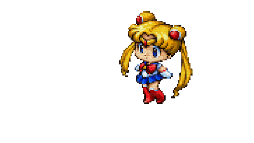

## ⭐ Front-End Developer (Angular + TypeScript)

I build tidy UIs for complex products—keeping components reusable, styles sane, and flows smooth.
<!--  -->

- 💗 logic-heavy screens & clear UX  
- 💖 reusable components & clean patterns  
- 👾 tiny experiments & uni projects for now — more landing soon  
- 🌱 learning: React & Next.js

  

---

## ⭐ Tech I use

**Languages & Core**

  
  
  
  

**Frontend & UI**

  
  
  
  

**Sometimes / supporting**

  
  
  
  
  
  
  

---

<!-- 

  
💫 extras

  

    
  

  <!-- uncomment after your workflow publishes the svg to output/gh-pages -->
  <!-- 

 -->
<!-- 
 -->

<!-- notes: keep it cute & readable; update pinned repos when you add new projects. -->
